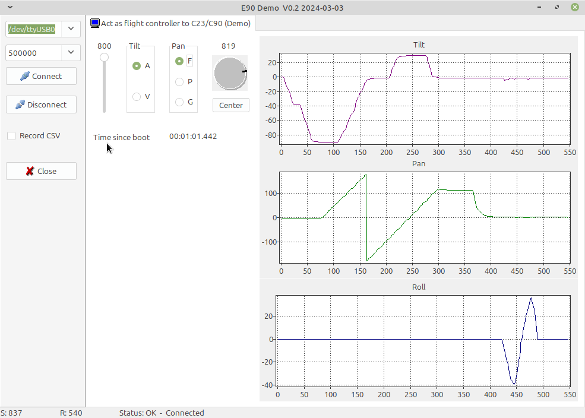

# E90controlDemo
Control a C23/E90 camera to use for other purposes

This Demo shows how to control the gimbal of a C23 or E90 camera (and possibly all cameras that fits H Plus, H3 or H520).
You can do all what ST16S can do, tilt, pan in the different modes.

The charts on the right showing the results sent by MAV message MOUNT_ORIENTATION.

Gimbal control is done with a Yuneec specific MAV message, MsgID 5000. The CRC_EXTRA for this message is 252.

Gimbal calibration is done with a Yuneec specific MAV message, MsgID 5002. The CRC_EXTRA for this message is 224.
